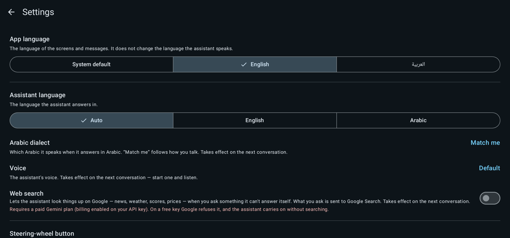
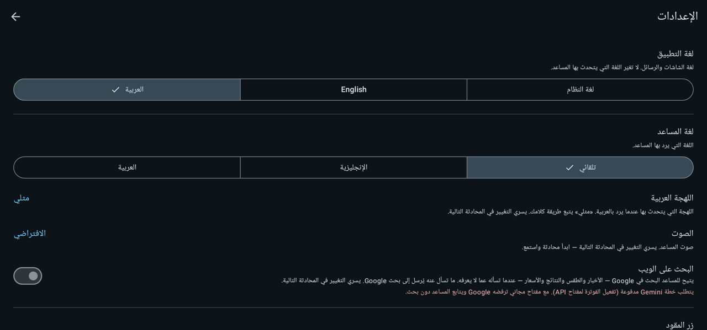

# BYD Assistant NG

A hands-free voice assistant for **BYD DiLink head units**, built on Google's **Gemini Live** API. Press the
microphone button on the steering wheel, talk naturally in Arabic or English, and it can answer, navigate,
open apps, control the media player — and, optionally, operate the car's comfort controls.

> **Unofficial.** This is an independent, community project. It is not affiliated with, endorsed by or
> supported by BYD or Google. "BYD", "DiLink" and "Gemini" are trademarks of their respective owners.
> You use it entirely at your own responsibility — see [Safety](#safety).

| English | العربية (right-to-left) |
| --- | --- |
|  |  |
|  |  |

## What it does

- **Natural conversation** with Gemini Live: speak, it answers aloud, and you can talk over it to interrupt.
- **Steering-wheel button** starts and ends a conversation (an accessibility service that watches that one key).
- **Status banner** on screen shows whether the mic is live, the assistant is thinking, or it is speaking.
- **Navigation** ("take me to …"), **open any installed app** by name, and **play / pause / next / previous**.
- **Web search** through Google Search (optional; needs a paid Gemini plan — see below).
- **Vehicle control** (experimental, off by default): A/C (power, temperature, fan, air direction, air source,
  ventilation, compressor, auto, defrost), windows (open/close or any position), sunroof, sunshade, trunk,
  volume, seat heating / ventilation / massage, steering-wheel heating, the cabin light and the fridge. The
  full list, with ids and what is verified, is in [vehicle-commands.md](docs/byd-internals/vehicle-commands.md).
- **English and Arabic**: the whole app is translated, including full right-to-left layout. *App language*
  (screens and messages) and *Assistant language* (what it speaks) are separate settings, as are the
  assistant's voice and, for Arabic, its dialect.

## Requirements

- A BYD DiLink head unit running an Android-13-based system (arm64). Vehicle control was developed and tested
  on a single vehicle and firmware; other models may behave differently.
- A **Gemini API key** from [Google AI Studio](https://aistudio.google.com/).
- An internet connection for the head unit (for example a phone hotspot).
- **ADB debugging** switched on in the head unit. It is used locally, over the loopback interface, to switch the
  steering-wheel service on and to run the helper process that talks to the vehicle services (the vehicle
  permissions are signature-level, so an ordinary app process cannot hold them). If the unit asks to authorise
  debugging, allow it. See [SECURITY.md](SECURITY.md) for what that implies.

## Installing

1. Download the APK from the project's **Releases** page and install it on the head unit (a file manager, or
   `adb install`). Allow installs from unknown sources if asked.
2. Open the app and follow the setup: grant the microphone, enter your Gemini API key, and turn on the
   steering-wheel button.
3. On BYD firmware, switch the app on in the head unit's **auto-start** screen (Settings → *Open auto-start
   settings*). Without it the system can close the app when the car sleeps, which turns the button off.
4. Optional: turn on *Vehicle control* in Settings. Read the warning first.

## Privacy

- What you say is streamed to the Gemini API to produce the reply. Nothing is sent anywhere else, and there is
  no analytics or tracking.
- With **Web search** on, the questions you ask are also sent to Google Search.
- The API key is stored encrypted on the device. Logs stay on the device until you choose to share them — and
  can contain what you said, so read one before you send it.

## Safety

Vehicle control is **experimental** and **disabled until you turn it on** in Settings. Use it while parked and at
your own risk. Anything that affects driving — engine, gearbox, motor, brakes, driver assistance, radar,
security and power systems — is deliberately not reachable: those commands are excluded from the command list,
never offered to the model, and refused again at dispatch time. Commands confirm their effect by reading the
car's state back, and report honestly when the car did not apply them.

## Web search

Google only allows search grounding on a **paid Gemini plan** (billing enabled on the API key's project). The
setting is off by default; on a free key Google refuses the session, and the app retries without search.

## Documentation

| | |
| --- | --- |
| [docs/byd-internals](docs/byd-internals/README.md) | How the app reaches the car's internals, the ids and values found, the research method, and what did **not** work |
| [docs/architecture.md](docs/architecture.md) | How the app is put together |
| [tools/probes](tools/probes) | The read-only probes used to explore a head unit |
| [CONTRIBUTING.md](CONTRIBUTING.md) | Branches, releases, adding a control, translations |
| [SECURITY.md](SECURITY.md) | What the app can do, what it stores, and how to report a vulnerability |

## Building

Requires JDK 21 and the Android SDK.

```bash
./gradlew assembleDebug          # debug build (installs next to a release build as ".dev")
./gradlew testDebugUnitTest      # unit tests
./gradlew lintRelease            # lint
```

Optional build settings:

- `-Passistant.updateRepo=owner/repo` (or the `ASSISTANT_UPDATE_REPO` environment variable): the GitHub
  repository whose releases the in-app updater checks. Without it the app never checks for updates and hides
  the Updates section.
- A release signing key goes in `app/signing.properties` (not tracked). Never commit keystores or passwords.

## Branches

`main` is development; a commit starting with `beta:` (or a manual run) publishes a pre-release from it, and pushing to
`stable` publishes a release. See [CONTRIBUTING.md](CONTRIBUTING.md).

## Project layout

| Path | What is there |
| --- | --- |
| `gemini/` | Live API client, the conversation state machine, tool wiring, failure handling |
| `audio/` | Mic and speaker I/O, end-of-speech detection, talk-over (barge-in) detection |
| `vehicle/` | Command registry (`resources/vehicle_commands.json`), safety gate, the helper process |
| `service/` | The steering-wheel accessibility service and the status banner |
| `apps/`, `media/`, `navigation/` | The open-app, media and navigation tools |
| `res/values`, `res/values-ar` | English and Arabic strings — a unit test keeps the two in step |
